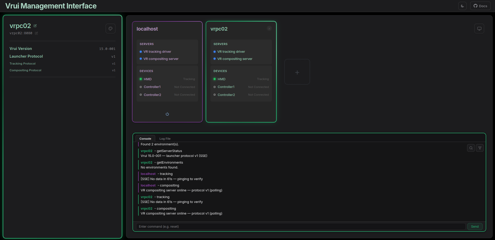
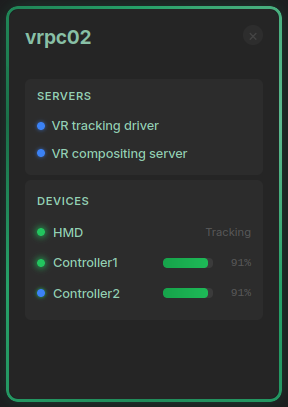
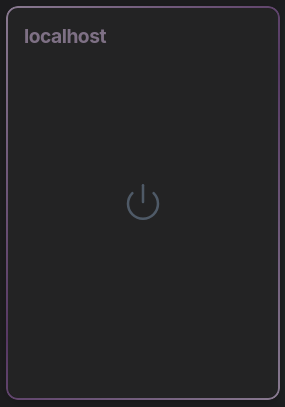
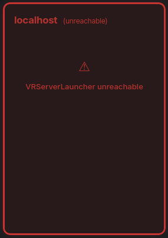
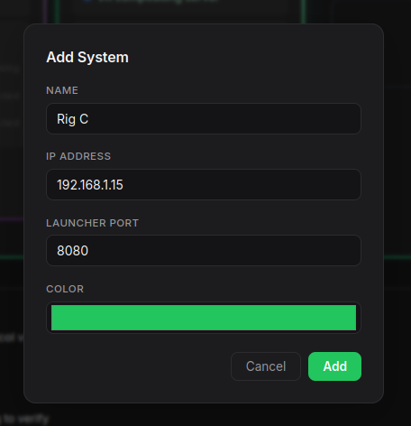
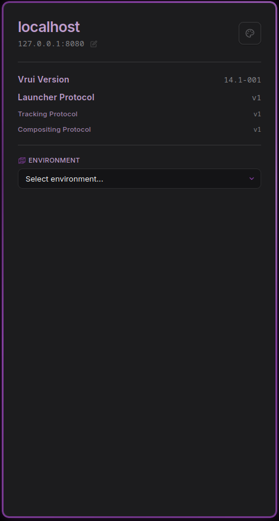

# Management Interface

The **Vrui Management Interface** is a browser-based dashboard for managing VR systems running the [Vrui](https://vrui-vr.github.io/) software stack.



## What You Can Do

- **Manage multiple VR systems** from one screen
- **Monitor devices** in real time — battery, tracking, and connection status
- **Control VR servers** — start, stop, and load environments remotely
- **Interact with hardware** — ping devices with haptic feedback & power them off
- **Send commands** via a live console with command history

## Quick Start

> [!NOTE]
> Vrui must be installed and built (`Make.sh`) before the interface can talk to any system.

1. Open `index.html` directly in any browser
2. A default **localhost** system is created automatically pointing to `127.0.0.1:8080`
3. Add remote systems with the **+** button
4. The interface connects immediately and switches to real-time push (SSE) once the server supports it

No build tools or servers required — the browser talks directly to the Vrui C++ backend.

## System States

Each system card shows one of three states:

| State | What It Means |
|-------|---------------|
| **Connected** | Launcher alive and servers running — full system color |
| **Disconnected** | Launcher alive but servers stopped — muted color |
| **Unreachable** | Can't contact launcher — red |





## Layout

```
┌─────────────────────────────────────────────────────────┐
│  [Logo]  Vrui Management Interface          [☀/☾] [Docs] │  ← Top bar
├──────────────┬──────────────────────────────────────────┤
│              │  [ System Card ]  [ System Card ]  ...   │
│   Sidebar    │                                          │
│  (selected   │                                          │
│   system)    ├──────────────────────────────────────────┤
│              │  Console  │  Log File                    │
│              │  ─────────────────────────────────────── │
│              │  (live log entries)                      │
└──────────────┴──────────────────────────────────────────┘
```

## Adding a System

1. Click the **+** button
2. Enter a **name**, **IP address**, and **launcher port** (default: `8080`)
3. Pick a color — appears in the color picker immediately



All configurations persist automatically via `localStorage`. Type `reset` in the console to clear everything and restore defaults.

## Sidebar



The sidebar shows connection details for the currently selected system:

- **System name and IP:port** — click either to edit
- **Color palette button** — change the accent color (persists across reloads)
- **Version info** — shown once the launcher responds (see [Protocol Versioning](developer.md#protocol-versioning))
- **Environment dropdown** — appears when the launcher reports available VR environments

## Next Steps

- **[Usage Guide](usage.md)** — How to use every feature
- **[Developer Reference](developer.md)** — Architecture, API, protocol versioning, and extending
